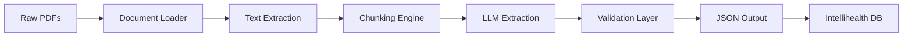
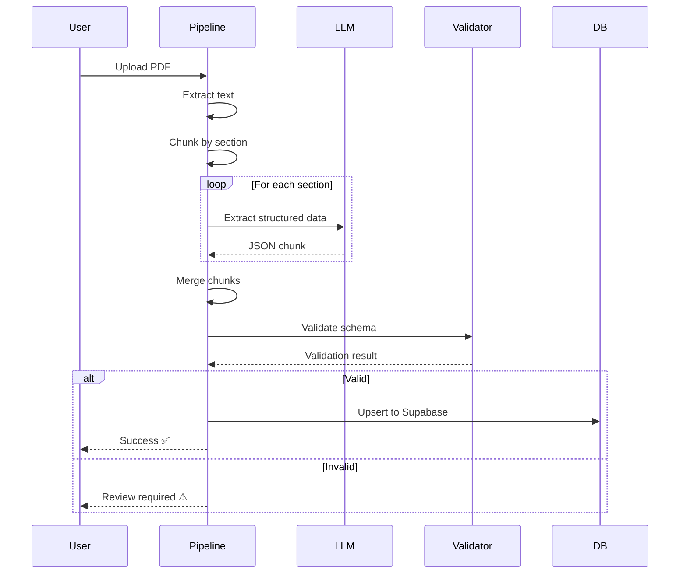

# Data Pipeline Architecture: PDF → JSON

This document outlines the recommended architecture for extracting structured data from South African medical scheme PDF brochures and integrating it with the Intellihealth app.

---

## 1. Pipeline Overview



| Stage | Tool | Purpose |
|-------|------|---------|
| **Document Loader** | LangChain `PyPDFLoader` | Load and parse PDF files |
| **Text Extraction** | `pdfplumber` or `PyMuPDF` | Extract text with layout preservation |
| **Chunking** | Semantic chunking | Split by section (Premiums, Hospital, etc.) |
| **LLM Extraction** | GPT-4o / Claude | Parse chunks into structured JSON |
| **Validation** | JSON Schema + Pydantic | Validate against `data-extraction-schema.json` |
| **Output** | JSON files / Supabase | Store for app consumption |

---

## 2. Recommended Tech Stack

### Core Pipeline
| Component | Recommendation | Why |
|-----------|----------------|-----|
| **Language** | Python 3.11+ | Best ecosystem for PDF/LLM tooling |
| **PDF Parsing** | `pdfplumber` | Handles tables well, preserves layout |
| **Orchestration** | LangChain or custom | Flexible chunking + LLM chaining |
| **LLM** | OpenAI `gpt-4o` | Best at structured extraction |
| **Validation** | Pydantic v2 | Type-safe JSON validation |
| **Storage** | Supabase (PostgreSQL) | Already in use by Intellihealth |

### Optional Enhancements
| Component | Tool | Why |
|-----------|------|-----|
| **OCR Fallback** | Tesseract / AWS Textract | For scanned PDFs |
| **Table Detection** | `camelot-py` | Specialized table extraction |
| **Caching** | Redis | Avoid re-processing unchanged PDFs |

---

## 3. Project Structure

```
medical-aid-data-pipeline/
├── src/
│   ├── loaders/
│   │   ├── pdf_loader.py        # PDF → raw text
│   │   └── table_extractor.py   # Table-specific logic
│   ├── chunkers/
│   │   ├── section_chunker.py   # Split by document sections
│   │   └── semantic_chunker.py  # Fallback semantic splitting
│   ├── extractors/
│   │   ├── base_extractor.py    # Abstract LLM extraction
│   │   ├── premium_extractor.py # Premium tables
│   │   ├── hospital_extractor.py
│   │   ├── procedure_extractor.py
│   │   └── pmb_extractor.py
│   ├── validators/
│   │   ├── schema_validator.py  # JSON Schema validation
│   │   └── business_rules.py    # Domain-specific checks
│   ├── outputs/
│   │   ├── json_writer.py       # Write to files
│   │   └── supabase_sync.py     # Push to database
│   └── main.py                  # Pipeline orchestrator
├── schemas/
│   └── data-extraction-schema.json  # (Copy from Intellihealth)
├── prompts/
│   ├── premium_extraction.md
│   ├── hospital_extraction.md
│   ├── procedure_extraction.md
│   └── pmb_extraction.md
├── data/
│   ├── raw/                     # Input PDFs
│   ├── intermediate/            # Extracted text/chunks
│   └── output/                  # Final JSON files
├── tests/
│   └── test_extractors.py
├── requirements.txt
└── README.md
```

---

## 4. Section-Based Extraction Strategy

Medical scheme brochures have predictable sections. Extract each independently:

| Section | Extraction Focus | Priority |
|---------|------------------|----------|
| **Premiums** | Monthly costs, income bands, MSA % | 🔴 Critical |
| **Hospital Benefits** | Cover limits, network list, co-payments | 🔴 Critical |
| **Chronic Medication** | CDL list, formulary, limits | 🟡 High |
| **Day-to-Day** | GP visits, specialists, radiology | 🟡 High |
| **Maternity** | Antenatal, scans, delivery cover | 🟢 Medium |
| **Oncology** | Cancer limits, protocols | 🟢 Medium |
| **Procedure Rules** | Per-procedure scheme rates, co-pays | 🔴 Critical |
| **PMB Matrix** | ICD-10 → treatment mappings | 🔴 Critical |

---

## 5. LLM Prompt Templates

### 5.1 Premium Extraction Prompt
```markdown
You are extracting premium data from a South African medical scheme brochure.

Given the following text from the "Premiums" section, extract:
1. Monthly premium for main member (in ZAR)
2. Monthly premium for adult dependant
3. Monthly premium for child dependant
4. Income-based premium tiers (if any)
5. MSA allocation percentage

Output as JSON matching this structure:
{
  "main_member": 1500,
  "adult_dependant": 1200,
  "child_dependant": 600,
  "msa_percentage": 25,
  "income_bands": [...]
}

TEXT:
{chunk_text}
```

### 5.2 Procedure Extraction Prompt
```markdown
You are extracting procedure-specific coverage rules from a medical scheme brochure.

For EACH procedure mentioned, extract:
- Procedure name
- Scheme rate (ZAR amount the scheme pays)
- Member co-payment (ZAR amount member pays)
- Whether it's PMB covered (true/false)
- Pre-authorization requirement (true/false)
- Annual limit (null if unlimited)

Focus on these high-value procedures:
- Gastroscopy / Colonoscopy
- Knee / Hip Replacement
- Cataract Surgery
- MRI / CT Scans
- Caesarean Section

Output as JSON array:
[
  {
    "procedure_name": "Gastroscopy",
    "scheme_rate": 8500,
    "copayment": 0,
    "pmb_covered": true,
    "pre_authorization_required": true,
    "annual_limit": null
  }
]

TEXT:
{chunk_text}
```

---

## 6. Validation Pipeline

### 6.1 Schema Validation
```python
from jsonschema import validate
import json

# Load schema
with open("schemas/data-extraction-schema.json") as f:
    schema = json.load(f)

# Validate extracted data
def validate_extraction(data: dict) -> bool:
    try:
        validate(instance=data, schema=schema)
        return True
    except Exception as e:
        log_error(e)
        return False
```

### 6.2 Business Rules
```python
def validate_business_rules(plan: dict) -> list[str]:
    errors = []
    
    # Premium sanity check
    if plan["premiums"]["main_member"] < 500:
        errors.append("Premium too low - likely extraction error")
    
    # MSA percentage check
    if plan["msa"]["allocation_percentage"] > 35:
        errors.append("MSA % unusually high - verify")
    
    # Network consistency
    if plan["identity"]["network_type"] == "Network":
        if not plan["hospital_benefits"].get("network_hospitals"):
            errors.append("Network plan missing hospital list")
    
    return errors
```

---

## 7. Output Integration

### 7.1 JSON File Structure
Output one JSON file per plan:
```
data/output/
├── discovery/
│   ├── smart-classic-2026.json
│   ├── classic-saver-2026.json
│   └── essential-saver-2026.json
├── bestmed/
│   ├── pace2-2026.json
│   └── beat1-2026.json
└── bonitas/
    └── bonclassic-2026.json
```

### 7.2 Supabase Sync
```python
from supabase import create_client

def sync_to_supabase(plan_data: dict):
    supabase = create_client(SUPABASE_URL, SUPABASE_KEY)
    
    # Upsert plan identity
    supabase.table("plans").upsert({
        "slug": plan_data["identity"]["plan_slug"],
        "scheme_slug": plan_data["identity"]["scheme_slug"],
        "name": plan_data["identity"]["plan_name"],
        "year": plan_data["identity"]["year"],
        "data": plan_data  # Store full JSON in JSONB column
    }, on_conflict="slug").execute()
```

---

## 8. Recommended Workflow



---

## 9. Error Handling Strategy

| Error Type | Handling |
|------------|----------|
| **PDF Unreadable** | Flag for OCR processing |
| **Table Extraction Fail** | Fall back to LLM table parsing |
| **LLM Parse Error** | Retry with simpler prompt |
| **Schema Validation Fail** | Queue for manual review |
| **Business Rule Violation** | Log warning, allow override |

---

## 10. Suggested Supabase Schema

```sql
-- Plans table (core entity)
CREATE TABLE plans (
    id UUID PRIMARY KEY DEFAULT gen_random_uuid(),
    slug TEXT UNIQUE NOT NULL,
    scheme_slug TEXT NOT NULL,
    name TEXT NOT NULL,
    year INTEGER NOT NULL,
    network_type TEXT,
    data JSONB NOT NULL,  -- Full extracted data
    created_at TIMESTAMPTZ DEFAULT NOW(),
    updated_at TIMESTAMPTZ DEFAULT NOW()
);

-- Procedures table (for fast lookups)
CREATE TABLE procedures (
    id UUID PRIMARY KEY DEFAULT gen_random_uuid(),
    plan_id UUID REFERENCES plans(id),
    procedure_name TEXT NOT NULL,
    scheme_rate NUMERIC,
    copayment NUMERIC,
    pmb_covered BOOLEAN,
    pre_auth_required BOOLEAN
);

-- Index for common queries
CREATE INDEX idx_plans_scheme_year ON plans(scheme_slug, year);
CREATE INDEX idx_procedures_name ON procedures(procedure_name);
```

---

## 11. Next Steps

1. **Set up Python project** with recommended structure
2. **Copy `data-extraction-schema.json`** to pipeline repo
3. **Create prompt templates** for each section type
4. **Test with 1 PDF** from each scheme (Discovery, Bestmed, Bonitas)
5. **Build validation layer** with business rules
6. **Implement Supabase sync** to push data to Intellihealth

---

> **Estimated Development Time**: 2-3 days for MVP pipeline
> **Estimated Processing Time**: ~30 seconds per PDF (with GPT-4o)
